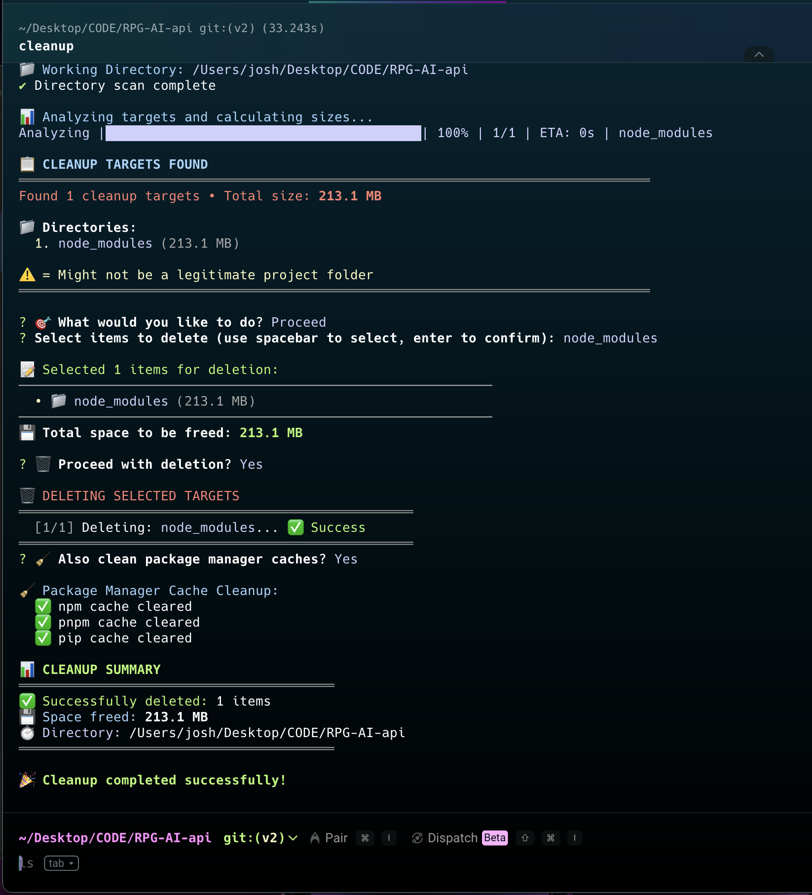

# Project Cleanup Tool

A CLI tool for cleaning up development project directories by removing build artifacts, dependencies, cache files, and other temporary files that accumulate during development.

[](https://github.com/JOSH1059/projects-cleanup/actions/workflows/release.yml)

**See it in action:**



## Why Use This Tool?

During development, projects accumulate various temporary files and directories that consume significant disk space:
- `node_modules` directories (often hundreds of MB each)
- Build artifacts (`.next`, `dist`, `build`, `out`)
- Python cache (`__pycache__`, `.pytest_cache`, `venv`)
- Package manager caches (npm, pnpm, yarn, pip)
- System junk (`.DS_Store`, `Thumbs.db`, log files)

This tool helps you reclaim disk space by safely identifying and removing these files across multiple projects at once.

---

## Installation

Install directly from GitHub (no npm publish required):

```bash
npm install -g https://github.com/JOSH1059/projects-cleanup/releases/latest/download/projects-cleanup.tgz
```

That's it. The tool is now available as `cleanup`, `clean`, `pcl`, `cleanup-projects`, or `project-cleanup`.

### Requirements

- Node.js >= 14.0.0

---

## Updating

Run the same install command on any machine to update to the latest version:

```bash
npm install -g https://github.com/JOSH1059/projects-cleanup/releases/latest/download/projects-cleanup.tgz
```

The tool will also notify you at the end of a run if a newer version is available on GitHub.

---

## Usage

### Commands

| Command | Description |
|---------|-------------|
| `cleanup [directory]` | Interactive cleanup (defaults to current directory) |
| `cleanup stats [directory]` | Preview cleanup targets without deleting |
| `cleanup config` | Show current cleanup configuration |
| `cleanup credits` | Show version, author, and license info |

### Options

| Option | Description |
|--------|-------------|
| `[directory]` | Directory to scan (default: current directory) |
| `-d, --dry-run` | Preview what would be deleted without deleting |
| `-v, --verbose` | Show detailed error messages and stack traces |
| `--no-interactive` | Non-interactive mode |
| `--credits` | Show version, author, and license info |

### Examples

```bash
# Preview what would be cleaned (no deletion)
cleanup --dry-run
cleanup stats ~/Desktop/CODE

# Interactive cleanup
cleanup
cleanup ~/Desktop/CODE

# Show configuration
cleanup config

# Show credits
cleanup credits
cleanup --credits
```

---

## How It Works

1. Scans the directory recursively for cleanup targets
2. Validates each target against known project indicators (e.g. `package.json`, `pyproject.toml`)
3. Displays all found targets with sizes and warnings for suspicious entries
4. Lets you select exactly what to delete via interactive checkboxes
5. Confirms before deleting anything
6. Deletes selected items and optionally cleans package manager caches
7. Shows a summary of what was freed

---

## Supported Cleanup Targets

### Node.js / JavaScript
- `node_modules/` — package dependencies
- `.next/` — Next.js build cache
- `dist/`, `build/`, `out/`, `.output/` — build outputs
- `.turbo/`, `.nuxt/`, `.docusaurus/`, `.vuepress/dist/` — framework caches

### Python
- `venv/`, `.venv/` — virtual environments
- `__pycache__/` — bytecode cache
- `.pytest_cache/` — pytest cache
- `.coverage`, `coverage/`, `.nyc_output/`

### Java / JVM
- `target/` — Maven build output
- `.gradle/` — Gradle cache

### Universal
- `.DS_Store`, `Thumbs.db`
- `*.log`, `*.tmp`, `*.temp`
- `.cache/`, `tmp/`, `temp/`

---

## Safety

- **Project validation** — only targets directories inside real projects (checks for `package.json`, `pyproject.toml`, etc.)
- **Warning flags** — marks entries that don't appear to be in a legitimate project
- **Dry run** — preview everything before committing
- **Confirmation prompt** — explicit confirm required before any deletion

---

## Package Manager Cache Cleanup

After deleting project files, the tool optionally cleans global package manager caches:

| Manager | Command |
|---------|---------|
| npm | `npm cache clean --force` |
| pnpm | `pnpm store prune` |
| yarn | `yarn cache clean` |
| pip | `pip cache purge` |

---

## Development

```bash
git clone https://github.com/JOSH1059/projects-cleanup.git
cd projects-cleanup
npm install
npm install -g .   # install globally from local source
```

To release a new version: bump the version in `package.json`, commit, and push to `main`. A GitHub Action will automatically create a git tag and GitHub Release.

---

## License

MIT
